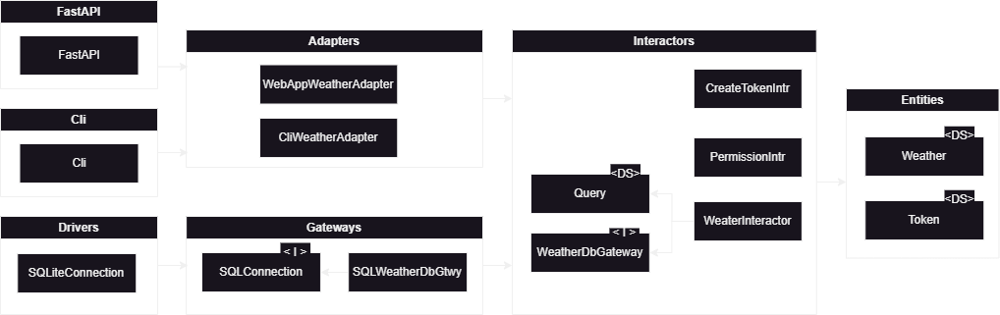

# Weather API 

This application allows you to store and query weather data for a greenhouse.

## API 

The application exposes the following endpoints: 

- *`POST /login`* --> Create a new access token
- *`POST /weather`* --> Ingest weather data; requires authentication through token 
- *`GET /weather/latest`* --> Query weather data; requires authentication through token
- *`GET /weather/average`* --> Query weather data; requires authentication through token
- *`GET /weather/timeseries`* --> Query weather data; requires authentication through token

## Architecture 

On a high level, the architecture of the app consists of the four levels described by Uncle Bob in [Clean Architecture](https://blog.cleancoder.com/uncle-bob/2012/08/13/the-clean-architecture.html): 

- **Layer 1 -** Entities
- **Layer 2 -** Interactors 
- **Layer 3 -** Gateways and adapters
- **Layer 4 -** Frameworks and drivers

This translates to the following for this application: 



The 6 core modules are: 

* **Entities** - holds basic data structures (i.e. the `WeatherData`, which represents a snapshot of the climate state at a point in time).
* **Interactors** - holds the two main interactors, responsible for the business logic (i.e. adding new weather data, querying)
* **Gateways** - holds implementations of the gateway interfaces, responsible for translating database context (i.e. SQL) to application context (i.e. entities)
* **Drivers** - concrete database drivers
* **Adapters** - holds classes responsible for transforming data from UI to interactors
* **FastApi** - external package, web framework 

Next to that, we have an `exceptions.py` module, that contains custom exceptions used throughout the package; a `main.py` module, responsible for tying everything together; and a `cli.py` module, which drives a CLI for bulk uploading files from disk (`source_weather_cli`).

Note that the majority of the work (i.e. averaging, resampling) is pushed to the database, since these are typically better at these types of operations than Python, and come with some out of the box functionality for it. Alternatively, you could use something like `polars`, if you don't want to burden the database with workload other than insert and querying. 

## Security 

All end-points are secured by an access token, that can be created by hitting the `/token` end-point. I've assumed that creating and managing users is not part of the scope of this application, so have hard-coded two users into the app: 

```json 
{
    "id": 1,
    "email": "john@company.com",
    "hashed_pw": "password1",
    "privileges": ["weather:read", "weather:write"],
},
{
    "id": 2,
    "email": "pete@company.com",
    "hashed_pw": "password2",
    "privileges": ["weather:read"],
},
```

Although it says `hashed_pw`, since I assumed user management to not be part of this service, I did not implement a fancy hashing algorithm. To login, simply use the e-mail as username, and the password as show above. 

## Developing 

Development requires Python and Poetry. For installing Poetry, refer to the [official installation instructions](https://python-poetry.org/docs/#installation).

With that in place, run: 

```shell
poetry install  # Creates environment and install dependencies
poetry shell    # Activates environment
```

...and you should be good to go. To run the app in local mode, execute: 

```shell 
uvicorn app.main:main --port 8000
```

You can now hit `http://localhost:8000/docs` to see the OpenAPI interface. The app should be connected to a local SQLite database, pre-loaded with the test data.

The `scripts` folder contains several useful scripts: 

* `build.sh` - builds the Docker image 
* `clean.sh` - cleans all non-controlled files (e.g. virtual environment / cache)
* `reset_dev_db.sh` - creates a fresh development database; requires `sqlite3` CLI to be installed
* `format.sh` - applies auto-formatting 
* `test.sh` - runs tests 
* `serve.sh` - serves the app

A debug launcher is also configured for VSCode - simply hit F5. 

## Running as Docker container

If you don't want to install Poetry, and simply want to run the app, you can build a Docker image, and use that to run the app in a container. To do so, run `./scripts/build.sh`, and use the command prompted by the script to run the container.

## Discussion and further work

With this very basic setup in place, I think the next steps would be to discuss the following topics: 

- We'll want to handle more than one greenhouse; this creates a more complex authorization structure, with a many-to-many relationship between users and greenhouses.
- How do we want the output? I've now pivoted it, but it kind of depends on what the front-end devs want. 
- Do we need to store the status data enums? What do these represent? 
- We now have both the ETL part and the querying part in one app. It might be better to separate this?
- I've used a simple SQLite database, but this is obviously not good for production... we could either go for something like Postgres, but perhaps InfluxDB is a better alternative. Modifying the app should be pretty easy. If we go for postgres, we'd need to create new `SQLConnection` and `SQLCursor` implementations, and plug them in. If we go for InfluxDB, we'll need to create a new `WeatherDbGateway`.
- I have hardcoded the JWT encryption key and users into the app, which is not a production-ready setup. How do we plan to do user management? Generating tokens is probably better left to a dedicated service, since I expect this app to be part of a larger ecosystem. 
- Deployment and CI/CD strategy. 
